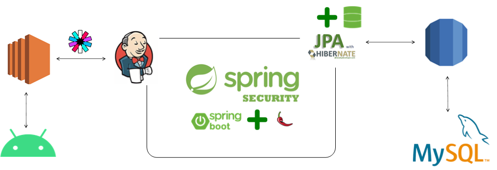

<h3>Android API Server</h3>

그:숲은 스터디를 목적으로하는 그룹에서 정해진 시간에 카메라로 사진을 찍어 

내가 스터디에 참여하고 있는지에 대한 여부를 인증하는 플랫폼 입니다.

<h5>📚  Study In Project</h5>

- [AWS RDS MYSQL 배포 및 로컬 DB연결](https://velog.io/@kimgy0/AWS-RDS-%EC%9D%B8%EC%8A%A4%ED%84%B4%EC%8A%A4-%EC%83%9D%EC%84%B1)
- [AWS EC2 SpringBoot 배포](https://velog.io/@kimgy0/AWS%EC%97%90-SpringBoot%EC%97%B0%EB%8F%99%ED%95%98%EA%B8%B0)
- [JENKINS 설치](https://velog.io/@kimgy0/EC2%EC%97%90-JENKINS-%EB%B0%B0%ED%8F%AC-%EB%B0%8F-%EC%84%A4%EC%B9%98)
- [스프링 부트 EC2 파일 생성 IOExeption (Permission Denied)](https://velog.io/@kimgy0/EC2-%ED%8C%8C%EC%9D%BC-%EC%83%9D%EC%84%B1-IOExeption-Permission-Denied)

<h5>💻  use Tech</h5>

<h5>🖼  API and Function</h5>

